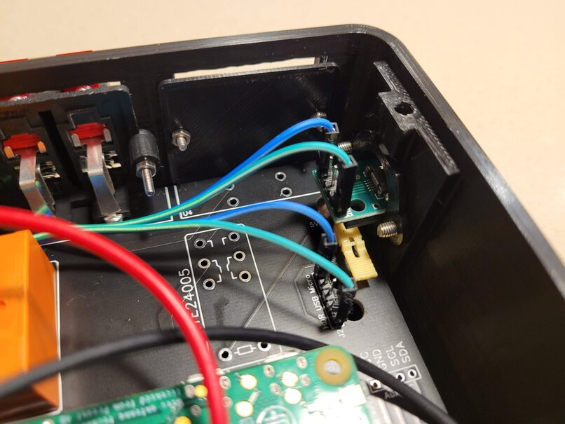

## Hardware Configuration

This project now uses a custom PCB design and 3D printed case (or case of your choice), eschewing the old design which modified the Niles 4-Channel Speaker Selector.  

There are currently two PCB options available for this project: 

1. **Integrated Relays (Recommended)** - This design integrates the relays into the project such that no additional relay modules are necessary.  Everything is neatly integrated, and fits nicely into an enclosure.  The drawback to this design is that it does require you to source the relays which can be a little more expensive, and there is a bit more soldering involved.  
	- PCB & Schematic for Main Board w/Relays: [OSHWLab](https://oshwlab.com/nebhead77/speakerselect-v1-main-board_copy_copy)
	- PCB & Schematic for Front Panel: [OSHWLab](https://oshwlab.com/nebhead77/speaker-select)
	- Boards can be directly ordered from EasyEDA & JLCPCB usually very inexpensively.  Simply click the above links, open the PCB in EasyEDA (while logged into your account), then click on Fabrication in the menu and PCB Fabrication File (Gerber).  You should have the option to order directly there. 
	- If I have any spare boards, I will have them available to order on [my Tindie Store here](https://www.tindie.com/stores/nebhead/). 

2. **External Relay Module(s)** - This design requires a seperate standard relay module(s) to be used.  The upside is that these relays are cheap and easy to find everywhere.  The downside is that it requires quite a bit of additional wiring, and is quite bulky.  More wires means more points of failure, and it's just frankly difficult to fit into a smaller enclosure.  
	- PCB & Schematic for Main Board: [OSHWLab](https://oshwlab.com/nebhead77/speakerselect-v1-main-board)
	- PCB & Schematic for Front Panel: [OSHWLab](https://oshwlab.com/nebhead77/speaker-select)
	- Boards can be directly ordered from EasyEDA & JLCPCB usually very inexpensively.  Simply click the above links, open the PCB in EasyEDA (while logged into your account), then click on Fabrication in the menu and PCB Fabrication File (Gerber).  You should have the option to order directly there. 

### The Parts List

The following is a high level parts list:

* **Raspberry Pi Zero W** - Technically any Raspberry Pi will do fine, but for this application a Raspberry Pi Zero W works really well and is the right price.  The newly released Pi Zero 2 W should also work great, boot faster and have more general snappiness. 
* **RTE24005 Relays** (for PCB w/Relays) - The star of the show is this relay which is a good, high-power, mechanical relay.  This relay is DPDT which means we can have a single relay that will control both audio channels at once.  They can be a little expensive, but at most you will need five of them (around $5/piece) so it's not so bad.  [Digi-Key](https://www.digikey.com/en/products/detail/te-connectivity-potter-brumfield-relays/RTE24005/1095362)
* **8-Channel Relay** (for PCB w/o Relays) - If going with the Relay Module Option, you will need to purchase at least an 8-Channel Relay for three sets of speakers & speaker protection.  I use two relays per set of speakers (left and right channels), and personally don't use the fourth set of speakers. Thus I can use six of the relays for the three sets of speakers and two relays for the speaker protection on the output. If you are going this route and need that fourth set of speakers, you'll need to get another two channel relay for that last speaker pair. [Amazon Link](https://www.amazon.com/dp/B0057OC5WK/ref=cm_sw_em_r_mt_dp_U_TktNCbPC5MVRB)
* **IR Reciever** - In this project, I've used the TSOP38238 because of the availability and the fact that there was good documentation / other pi projects that I was able to reference online. [Amazon Link](https://www.amazon.com/dp/B005T960JC/ref=cm_sw_em_r_mt_dp_U_Z.kTCbZZ3RN6F ) or with transmitter as well [Amazon Link](https://smile.amazon.com/gp/product/B08594ZSJQ/) (Note that you may find cheaper options, but this is the one I ended up using)
* **Resistors** - An assortment of 10k Ohm and 1k Ohm resistors for the PCB with relays. For the LEDs, I've sized 10k ohm resistors for my projects due to the brightness of my LEDS.  You may want to do some prototyping before soldering into your project.  Given this sits in my home theater cabinet, I wanted the LEDs to be dimmer.  
* **LEDs** - Again, these are personal preference, or whatever you might have laying around the house.  I've used clear white LEDs for the speaker selections, and a clear blue LED for the protection indicator.  My LED's are very bright, so as mentioned above, I have decided to go with a beefier resistor. For the 3D printed design, you may want to utilize a 3mm LED for the front panel LEDs. 
* **BC547 Transistors** - For the PCB with relays, I used the BC547 transistor to help with switching the 5V supply to the relay.  [Amazon Link](https://smile.amazon.com/gp/product/B06Y4M2N29)
* **PC817 Optoisolator** - For the PCB with relays, I use these surface mount optoisolators for switching the relay on/off.  [Amazon Link](https://smile.amazon.com/gp/product/B07FJ76X42)
* **1N4007 Diodes** - For the PCB with relays, I use these relays to prevent flyback voltage accross the inputs to the relay.  [Amazon Link](https://smile.amazon.com/gp/product/B07Q5FZR7X) 
* **Screw Terminals** - 5mm pitch screw terminals are used to connect up the high power resistors and if you are using the PCB w/o relays, you'll use these to connect the PCB to the relays.  [Amazon Link](https://smile.amazon.com/gp/product/B01F7KOM10)
* **Micro SD Card** - Greater than 4GB is required for Raspbery Pi OS Lite. 
* **MicroUSB Power Adapter** - At least 1 amp current recommended.
* **USB Power PCB** - These little boards are great for adding power-input to your project.  Power is routed via this connector through the PCB to the rest of the components.  [Amazon Link](https://smile.amazon.com/gp/product/B07W844N43)
* **Speaker Terminals** - These specific terminals were what I used and they seem to work great.  Some of the springs are a little flimsy, so don't tweak these too far or they just might come apart.  [Amazon Link](https://smile.amazon.com/gp/product/B07QNWQR87)
* **High Power Resistors 2.5Ohm +-1%** (2x) - These resistors are needed for the speaker protection capability of this design.  Since these are a bit expensive and difficult to find, you'll likely just need to order from a reputable electronics retailer.  I sourced mine from Mouser, but there are other options. [Mouser Link](https://www.mouser.com/ProductDetail/284-HS502R5F)
* **Self Latching Button** - Used for the power switch (this is optional - but if omitted, requires the power switch header to be jumpered).  [Amazon Link](https://smile.amazon.com/gp/product/B075VBV4QH)
* **Raspberry Pi Header** - 40 Pin header for the Raspberry Pi.  [Amazon Link](https://smile.amazon.com/gp/product/B00R1LLM1M)
* **Various 2.54mm Pitch Headers** - Needed for connecting button boards, etc. [Amazon Link](https://smile.amazon.com/gp/product/B01FWC53C0)
* **Tactile Switches** - Needed for the front panel buttons. [Amazon Link](https://smile.amazon.com/gp/product/B071KX71SV)

### Hardware Setup

Since my personal setup will use the living room speakers, by default, 99% of the time I've set this up as "normally closed" on the relays.  The other three sets of relays can be normally open since they're more rarely used.  This will hopefully save the relays from getting worn out too quickly.

I've added an IR receiver (https://amzn.com/B005T960JC) so that I can also use my universal remote to control the speaker output.  This is likely optional, but a really convenient addition to the project.  

Since it's usually easiest to just look at the pictures and understand how this is built out, I'm just going to spam a bunch of images here and hopefully this will help. 

This is the PCB w/Relays integrated.  The screw terminals on the top/left are for the high power resistors which shoudld be affixed to a heat sink of some kind (in my case, a piece of aluminium).  

The following is a picture of the 3D printed case alongside the PCB. 

The PCB mounted inside the case, just above the aluminum plate.  Affixed to the body of the of the enclosure with M5 bolts directly into the plastic. 

This is a 3D printed plug for the USB power PCB.  This makes it easier to mount elsewhere and to replace in the case it is damaged.  

USB Power Module mounted in the enclosure.  You'll see that I had the power switch jumpered below this.  Later I have connected this to a latching switch. 

This is the wire terminal where we are connecting the high power resistors.  I'm using a 16 Gauge wire with ferulles, but you don't have to make it as fancy.  In fact it's possible to solder these wires directly to the board if desired.  

To attach the high power resistors to the aluminum plate, I opted to use double-sided thermal tape.  This makes attaching the resistors a cinch, without messy thermal paste involved.  

I used a bit too much wire for the resitors, but I wanted to be absultely sure that I had enough to reach.  

Here are some simple Dupont connectors for the power. 

A picture of the front panel PCB mounted inside the enclosure.  

You can also see the latching power switch has been mounted.  

Wiring could be optimized further, but more pictures for tutorial purposes. 

From the front with the buttons and LEDs showing. 

Bonus picture with the PCB w/o Relays, using a module, this is what it looks like when being built out.  

 

### 3D Printable Enclosure

A 3D printable version of the enclosure is available for anyone interested.  This has gone through a couple of iterations and finally landed on the v2 design.  

These were designed to just barely fit on an Ender 3 printer.  Your mileage may vary, but these are pretty big prints and may take nearly a day to print just the base.  

[OnShape Designs](https://cad.onshape.com/documents/e374b0b8c597f50905bb1f46/w/30cfe5b0c8f7af4c6c65afb6/e/ff01555d66f3e2271151cb8e?renderMode=0&uiState=61b27ca88bec032ddcf83958) - Here you will find the design files that can be exported to STL and can also be cloned and tweaked for your needs.  The pieces of the file marked v2 are the most recent design.

[Thingiverse STLs](https://www.thingiverse.com/thing:5161122) - I've posted the STL files for the v2 here on Thingiverse so that you can print these directly yourself. 

### Case Assembly

The following is a visual guide to assembling the different case pieces for this project.  This is based on the PCB with relays, but might also be adapted for the other PCB design if you can get creative with wire management and mounting relay boards. 

The first few pictures ar of the base of the case, unpopulated, with a piece of 1mm aluminium cut to fit the between the PCB mounts.  The protective film was left on the top of the aluminium to provide further electrical short protection.  This plate serves as the bottom of the case, but also as additional heat sink for the high power resistors.  

The Aluminum is affixed to the bottom of the case with four 4mm bolts and nuts.  The rear of the aluminium plate, I have added some addtional electrical tape just to ensure that the longer soldered components don't short out on the panel.  

Nuts are recessed on the underside, but the case will still require some rubber feet to lift it off of any surface.  This is both to protect the surface and to keep the enclosure from sliding around.  

Rear panel uses some longer M2 bolts/nuts to provide a little more mechanical strength to the speaker terminals.  This is important because these terminals can put alot of force on the PCB when being used, if not affixed. 

Rubber feet that I used (stolen from an old computer case) for the bottom of the enclosure.  They're pretty chunky, but they work just great.  

Here is a blank panel that I printed to close off the fourth speaker pair opening.  Since I don't use this in my design, I decided to close this off.  

Final picture of the front of the case, with front panel buttons installed and the power buttons installed.  

