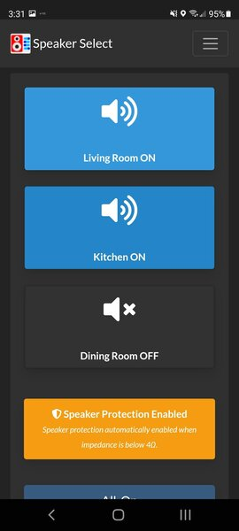
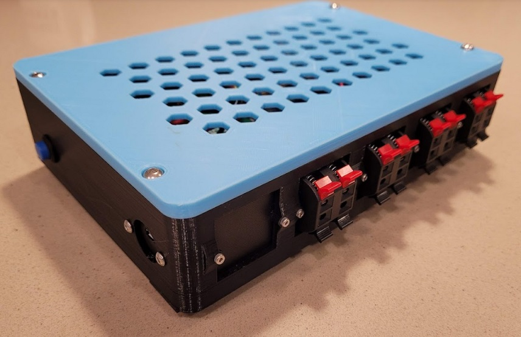

#  Speaker Select V3

## Raspberry Pi based Speaker Selector

***Note:*** *This project is continuously evolving, and thus this readme will likely be improved over time, as I find the inspiration to make adjustments.  That being said, I'm sure there will be many errors that I have overlooked or sections that I haven't updated.*

## What is This? 

Speaker Select V3 is an evolution of the speaker select projects which aim to provide a smart device accessible speaker selector hardware.  For those who need to be able to select different pairs of stereo speakers to output to.  Earlier versions of this project were based off of existing speaker selector hardware.  This version has it's own hardware design.  

This project utilizes a Raspberry Pi Zero W (or even the new Pi Zero W 2!), plugged into a custom PCB with high power relays to switch between speaker outputs (and speaker protection). 

### Features

- Stereo Speaker Input selectable to Four Stereo Speaker Outputs
- Auto speaker protection for configurations where impedance drops below 4 ohms 
- Web UI for remote control of speaker output accessible from any modern browser (phone, computer, tablet, etc.)
- Local API for usage by automation software like Home Assistant (example HA configuration provided)
- External API for usage by IFTTT or other automation (use at your own risk)
- Buttons for physical output control
- IR Remote capability for using IR remote input (example configuration provided for use with Harmony remote)
- Easy configuration via WebUI
- Auto-Dark Mode for WebUI based on your location
- Auto-Install Script
- 3D Printable Case

## Screenshot of WebUI

Here is a screenshot of the dashboard:



## Hardware 

A 3D printed enclosure is available for download.  Here is the back of the finished product:



## Introduction 

This project was inspired by David Liu and his excellent speaker selector [project.](http://iceboundflame.com/projects/multi-room-audio-control-with-rpi). I encourage you to check it out and get a rough idea of how this all works.

As mentioned above, this is an evolution of my [original speaker selector project](https://github.com/nebhead/spkr-select) which utilized a relay module and some other electronics that were wired up by hand. This is the third iteration of the project with custom designed PCBs (one that utilizes on-board relays, and one that can utilize a relay module similar to the original version).  Some might find this a little complicated to build, but for me it was a journey to learn more and more skills, so I encourage you to give it a shot and maybe you'll learn something new along the way. 

This project uses using Gunicorn and nginx to proxy web requests.  There are two processes running concurrently (control.py and app.py).  Control handles all of the RasPi GPIO interfaces, while App handles the web routes.  They communicate through a Redis database to improve speed and reliability.  

## Credits

Web Application created by Ben Parmeter, copyright 2020, 2021. Check out my other projects on [github](https://github.com/nebhead). If you enjoy this software & hardware and feel the need to donate a cup of coffee, a frosty beer or a bottle of wine to the developer you can click [here](https://paypal.me/benparmeter).

Of course, none of this project would be available without the wonderful and amazing folks below.  If I forgot anyone please don't hesitate to let me know.  

* **Speaker Selector** - This project was inspired by David Liu and his excellent speaker selector project [here](http://iceboundflame.com/projects/multi-room-audio-control-with-rpi).  I encourage you to check it out and get a rough idea of how this all works.

* **Bootstrap** - WebUI Based on Bootstrap 4.  Bootstrap is released under the MIT license and is copyright 2018 Twitter. [getbootstrap.com](http://getbootstrap.com)

* **JQuery** - Required by Bootstrap. Copyright JS Foundation and other contributors. Released under MIT license. [jquery.org/license](https://jquery.org/license/)

* **Popper** - Required by Bootstrap. Copyright 2016, 2018 FEDERICO ZIVOLO & CONTRIBUTORS. Released under MIT license. [popper.js.org](https://popper.js.org/)

* **FontAwesome** - Amazing FREE Icons that I use throughout this project.  Copyright Font Awesome.  Released under the Font Awesome Free License. [fontawesome.com](https://fontawesome.com/) [github.com](https://github.com/FortAwesome/Font-Awesome)

## Licensing

This project is licensed under the MIT license.

```
MIT License

Copyright (c) 2021 Ben Parmeter and Contributors

Permission is hereby granted, free of charge, to any person obtaining a copy
of this software and associated documentation files (the "Software"), to deal
in the Software without restriction, including without limitation the rights
to use, copy, modify, merge, publish, distribute, sublicense, and/or sell
copies of the Software, and to permit persons to whom the Software is
furnished to do so, subject to the following conditions:

The above copyright notice and this permission notice shall be included in all
copies or substantial portions of the Software.

THE SOFTWARE IS PROVIDED "AS IS", WITHOUT WARRANTY OF ANY KIND, EXPRESS OR
IMPLIED, INCLUDING BUT NOT LIMITED TO THE WARRANTIES OF MERCHANTABILITY,
FITNESS FOR A PARTICULAR PURPOSE AND NONINFRINGEMENT. IN NO EVENT SHALL THE
AUTHORS OR COPYRIGHT HOLDERS BE LIABLE FOR ANY CLAIM, DAMAGES OR OTHER
LIABILITY, WHETHER IN AN ACTION OF CONTRACT, TORT OR OTHERWISE, ARISING FROM,
OUT OF OR IN CONNECTION WITH THE SOFTWARE OR THE USE OR OTHER DEALINGS IN THE
SOFTWARE.
```
